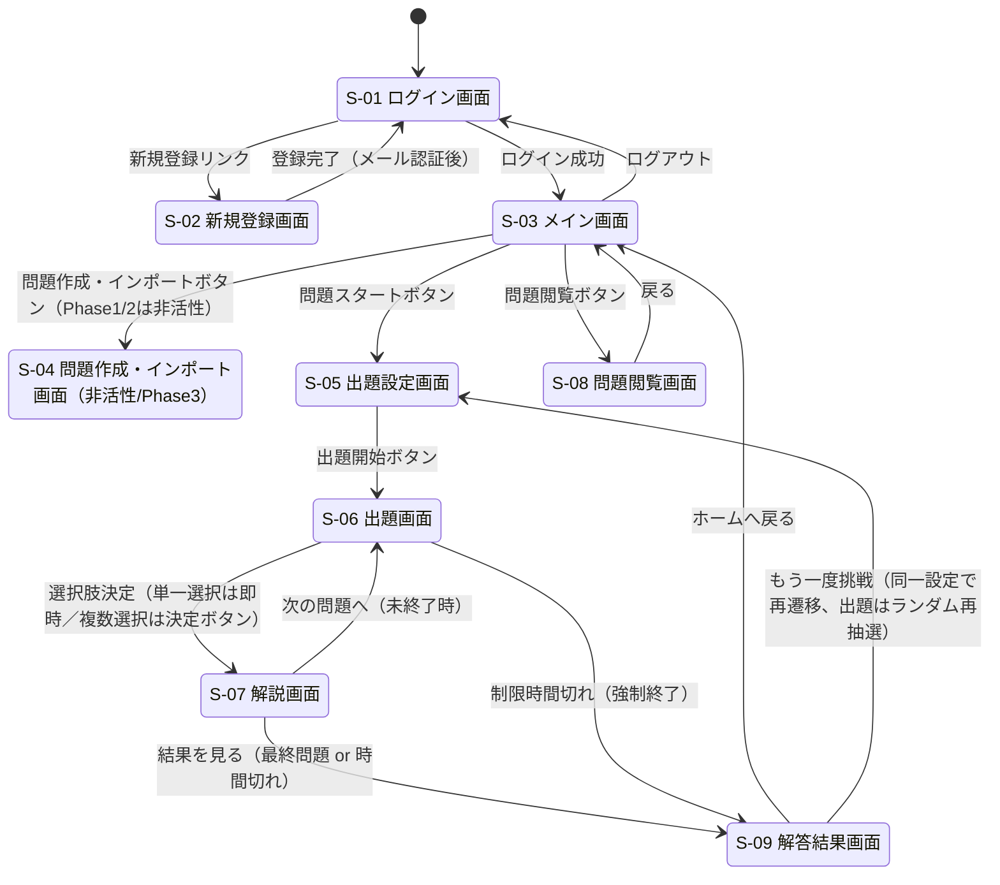
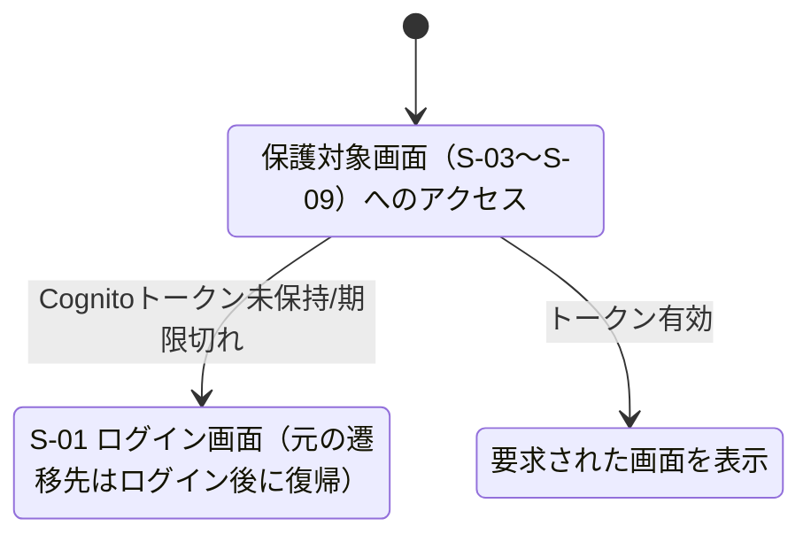

# 画面遷移図

要件定義書 §4.2 の遷移図をベースに、新規登録・ログアウト・未認証リダイレクトの経路を補って詳細化したもの。

## 全体遷移図

## 未認証時のガード遷移

## 遷移条件の補足

| 遷移元 | 遷移先 | トリガー | 備考 |
|---|---|---|---|
| S-01 | S-03 | ログイン成功（Cognito 認証OK） | JWT（IDトークン/アクセストークン/リフレッシュトークン）をクライアントに保持 |
| S-01 | S-02 | 「新規登録」リンク押下 | |
| S-02 | S-01 | メール認証コード確認完了 | Cognito のサインアップ確認フロー |
| S-03 | S-05 | 「問題スタート」ボタン押下 | |
| S-03 | S-08 | 「問題閲覧」ボタン押下 | |
| S-03 | S-04 | 「問題作成・インポート」ボタン押下 | Phase1・Phase2 ではボタン非活性のため遷移不可 |
| S-05 | S-06 | 「出題開始」ボタン押下 | 出題設定を元に `/questions/random` を呼び出しセッション開始（`POST /sessions`） |
| S-06 | S-07 | 単一選択: 選択肢タップ／複数選択: 「決定」ボタン押下 | 回答を `PUT /sessions/{sessionId}` で記録 |
| S-07 | S-06 | 「次の問題へ」ボタン押下（未終了時） | |
| S-07 | S-09 | 「結果を見る」ボタン押下（最終問題時） | |
| S-06/S-07 | S-09 | 制限時間切れ | クライアント側タイマーで検知、セッションを `expired`/`completed` として確定 |
| S-09 | S-03 | 「ホームへ戻る」ボタン押下 | |
| S-09 | S-05 | 「もう一度挑戦」ボタン押下 | 同一の資格・出題数・制限時間設定を引き継ぐ |
| 任意画面 | S-01 | セッション切れ・ログアウト | リフレッシュトークン失効時も同様 |
