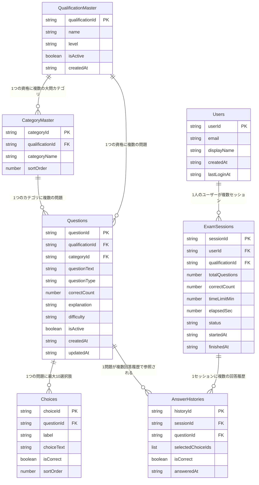

# ER図

DynamoDB はエンティティ単位のテーブル構成（単一テーブル設計ではない）であるため、ここではリレーショナルDBのER図に準じた形で論理的な関連を示す。実装上の外部キー制約は存在せず、アプリケーション（Lambda）側でGSIを用いた参照整合性を担保する。

## 論理ER図

## 関連の補足（DynamoDB実装上の参照方法）

| 関連 | 実装方法 |
|---|---|
| QualificationMaster 1 - N CategoryMaster | `CategoryMaster` の GSI `qualificationId` |
| QualificationMaster 1 - N Questions | `Questions` の GSI `qualificationId` |
| CategoryMaster 1 - N Questions | `Questions` の GSI `categoryId` |
| Questions 1 - N Choices | `Choices` の GSI `questionId` |
| Users 1 - N ExamSessions | `ExamSessions` の GSI `userId` |
| ExamSessions 1 - N AnswerHistories | `AnswerHistories` の GSI `sessionId` |
| Questions 1 - N AnswerHistories | `AnswerHistories.questionId`（GSI化はしない。セッション単位の参照が主なアクセスパターンのため） |

## 参照整合性の担保方針

DynamoDB はリレーショナルDBのような外部キー制約を持たないため、以下をアプリケーション（Lambda）側の実装規約とする。

- 問題登録（[API-05](../02_API設計/個別API設計書/API-05_問題インポート.md)）時、`qualificationId` が `QualificationMaster` に存在することをLambda側で検証してから `Questions` に書き込む。
- `Choices` は必ず `Questions` の登録と同一トランザクション相当の処理（DynamoDB TransactWriteItems）で作成し、孤立した選択肢が発生しないようにする。
- `ExamSessions`/`AnswerHistories` の削除・保持期間ポリシーは非機能設計（[非機能設計.md](../04_共通設計/非機能設計.md)）を参照。
