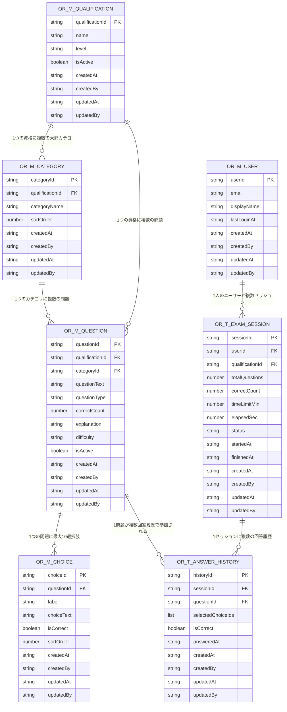

# ER図

DynamoDB はエンティティ単位のテーブル構成（単一テーブル設計ではない）であるため、ここではリレーショナルDBのER図に準じた形で論理的な関連を示す。実装上の外部キー制約は存在せず、アプリケーション（Lambda）側でGSIを用いた参照整合性を担保する。

テーブル名は物理テーブル名（`OR_{種類}_{テーブル名}`、[命名規約](../04_共通設計/命名規約.md) §2）で記載する。

## 論理ER図

`createdAt` / `createdBy` / `updatedAt` / `updatedBy` は全テーブル共通の監査項目（[テーブル一覧](テーブル一覧.md) §共通項目）。

## 関連の補足（DynamoDB実装上の参照方法）

| 関連 | 実装方法 |
|---|---|
| OR_M_QUALIFICATION 1 - N OR_M_CATEGORY | `OR_M_CATEGORY` の GSI `qualificationId` |
| OR_M_QUALIFICATION 1 - N OR_M_QUESTION | `OR_M_QUESTION` の GSI `qualificationId` |
| OR_M_CATEGORY 1 - N OR_M_QUESTION | `OR_M_QUESTION` の GSI `categoryId` |
| OR_M_QUESTION 1 - N OR_M_CHOICE | `OR_M_CHOICE` の GSI `questionId` |
| OR_M_USER 1 - N OR_T_EXAM_SESSION | `OR_T_EXAM_SESSION` の GSI `userId` |
| OR_T_EXAM_SESSION 1 - N OR_T_ANSWER_HISTORY | `OR_T_ANSWER_HISTORY` の GSI `sessionId` |
| OR_M_QUESTION 1 - N OR_T_ANSWER_HISTORY | `OR_T_ANSWER_HISTORY.questionId`（GSI化はしない。セッション単位の参照が主なアクセスパターンのため） |

## 参照整合性の担保方針

DynamoDB はリレーショナルDBのような外部キー制約を持たないため、以下をアプリケーション（Lambda）側の実装規約とする。

- 問題登録（[API-05](../02_API設計/個別API設計書/API-05_問題インポート.md)）時、`qualificationId` が `OR_M_QUALIFICATION` に存在することをLambda側で検証してから `OR_M_QUESTION` に書き込む。
- `OR_M_CHOICE` は必ず `OR_M_QUESTION` の登録と同一トランザクション相当の処理（DynamoDB TransactWriteItems）で作成し、孤立した選択肢が発生しないようにする。
- `OR_T_EXAM_SESSION`/`OR_T_ANSWER_HISTORY` の削除・保持期間ポリシーは非機能設計（[非機能設計.md](../04_共通設計/非機能設計.md)）を参照。
