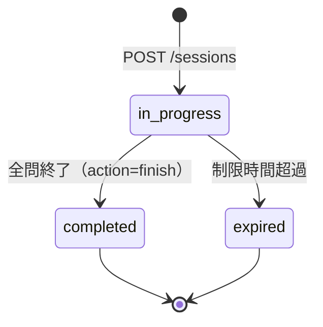

# T-06 OR_T_EXAM_SESSION（試験セッションテーブル）

| 項目 | 内容 |
|---|---|
| テーブル名 | OR_T_EXAM_SESSION |
| テーブル種類 | T（トランザクションテーブル） |
| 概要 | 1回の出題開始〜終了までの単位（セッション）を管理する |
| Phase | Phase 1 |
| プライマリキー | `sessionId`（パーティションキーのみ） |
| GSI | `userId-index`（PK: userId） |

## 1. 属性定義

| 属性名 | 型 | キー | 必須 | 説明 |
|---|---|---|---|---|
| sessionId | String | PK | 必須 | UUID |
| userId | String | GSI PK | 必須 | Cognito sub（セッション所有者） |
| qualificationId | String | | 必須 | 対象資格ID |
| totalQuestions | Number | | 必須 | 出題数 |
| correctCount | Number | | 必須 | 正解数（回答の都度インクリメント） |
| timeLimitMin | Number | | 必須 | 制限時間（分）。`0`=無制限 |
| elapsedSec | Number | | 必須 | 経過時間（秒）。クライアントからの申告値・サーバー算出値を突き合わせて更新 |
| status | String | | 必須 | `in_progress` / `completed` / `expired` |
| startedAt | String | | 必須 | 開始日時（ISO 8601） |
| finishedAt | String | | 任意 | 終了日時（`completed`/`expired` になった時点で設定） |
| createdAt | String | | 必須 | 【共通項目・登録日】レコード作成日時（ISO 8601）。業務上の開始日時は `startedAt` を正とする |
| createdBy | String | | 必須 | 【共通項目・登録者】セッション所有者の `userId`（Cognito `sub`） |
| updatedAt | String | | 必須 | 【共通項目・更新日】回答記録・状態更新の都度更新（ISO 8601） |
| updatedBy | String | | 必須 | 【共通項目・更新者】セッション所有者の `userId` |

共通項目（`createdAt` / `createdBy` / `updatedAt` / `updatedBy`）の設定規則は [テーブル一覧](../テーブル一覧.md) §共通項目を参照。`startedAt`/`finishedAt` は業務上の日時項目であり、共通項目とは別に保持する。

## 2. GSI定義

| GSI名 | パーティションキー | 用途 |
|---|---|---|
| userId-index | userId | ユーザーのセッション履歴取得（現状Phase1では未使用API、Phase3 F-10 進捗管理で使用予定） |

## 3. ステータス遷移



## 4. サンプルアイテム

```json
{
  "sessionId": "s1a2b3c4-...",
  "userId": "5f1e2d3c-cognito-sub",
  "qualificationId": "1Z0-085-JPN",
  "totalQuestions": 20,
  "correctCount": 16,
  "timeLimitMin": 30,
  "elapsedSec": 1580,
  "status": "completed",
  "startedAt": "2026-07-18T10:00:00.000Z",
  "finishedAt": "2026-07-18T10:26:20.000Z",
  "createdAt": "2026-07-18T10:00:00.000Z",
  "createdBy": "5f1e2d3c-cognito-sub",
  "updatedAt": "2026-07-18T10:26:20.000Z",
  "updatedBy": "5f1e2d3c-cognito-sub"
}
```

## 5. 利用API

- [API-07 試験セッション開始](../../02_API設計/個別API設計書/API-07_試験セッション開始.md)（作成）
- [API-08 セッション更新](../../02_API設計/個別API設計書/API-08_セッション更新.md)（更新: `correctCount`, `status`, `finishedAt`, `updatedAt`, `updatedBy`）
- [API-09 セッション取得](../../02_API設計/個別API設計書/API-09_セッション取得.md)（取得）

## 6. 備考

- `userId`・`createdBy`・`updatedBy` は必ずCognitoトークンから取得した値を使用し、クライアントが指定した値は信頼しない（要件定義書 §9.1）。
- 共通項目は監査用の内部項目であり、[API-07](../../02_API設計/個別API設計書/API-07_試験セッション開始.md)/[API-09](../../02_API設計/個別API設計書/API-09_セッション取得.md) のレスポンスには含めない。
