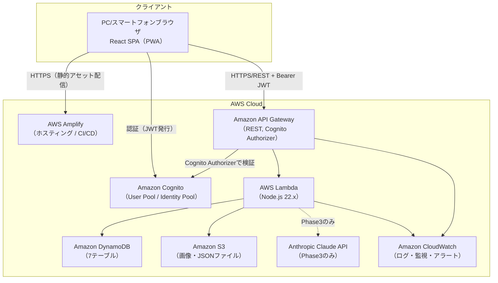
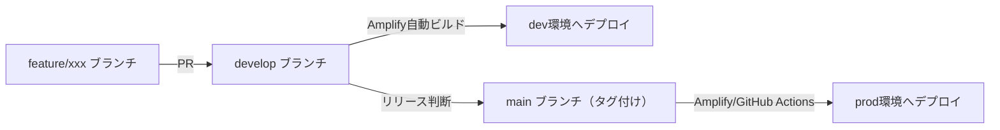

# システム構成・環境設計

要件定義書 §5, §10.3 をもとに、基本設計としてシステム構成・環境構成を整理する。

## 1. 全体構成図

## 2. AWSサービス構成（要件定義書 §5.2 再掲）

| サービス | 用途 | 設定概要 |
|---|---|---|
| Amazon Cognito | ユーザー認証 | User Pool + Identity Pool。JWT トークン発行（アクセストークン1時間、リフレッシュトークン30日） |
| Amazon API Gateway | REST API 管理 | ステージ: dev / stg / prod。全ルートに Cognito オーソライザー設定 |
| AWS Lambda | ビジネスロジック | Node.js 22.x。関数はAPIエンドポイント単位、またはリソース単位で分割（詳細は詳細設計で確定） |
| Amazon DynamoDB | データストア | オンデマンドキャパシティ。7テーブル構成（[テーブル一覧](../03_データベース設計/テーブル一覧.md)参照） |
| Amazon S3 | ファイルストレージ | 解説画像、JSONインポートファイル（Phase3）保存。パブリックアクセス完全ブロック |
| AWS Amplify | ホスティング / CI/CD | Reactアプリ（PWA）のビルド・配布管理 |
| AWS CloudWatch | ログ・監視 | Lambdaログ収集、API Gatewayアクセスログ、アラート設定 |
| AWS CDK（TypeScript） | IaC | 上記リソース一式をコードで管理 |

## 3. 環境構成（要件定義書 §10.3 再掲）

| 環境 | 用途 | AWSリソース | データ |
|---|---|---|---|
| dev | 開発・単体テスト | DynamoDB（小容量）/ Lambda | テスト用ダミーデータ |
| stg | 結合・受入テスト | dev と同等構成 | 本番相当データ（個人情報はマスキング） |
| prod | 本番 | オンデマンドスケール有効 | 本番データ |

- 各環境は API Gateway のステージ、DynamoDBテーブル名のプレフィックス（例: `dev-OR_M_QUESTION`）等で分離する。
- Cognito User Pool は環境ごとに別プールを用意する（dev/stg/prodでユーザーを共有しない）。

## 4. デプロイフロー

- フロントエンド: AWS Amplify のブランチ連動デプロイ（`develop`→dev、`main`→prod）。
- バックエンド（Lambda/API Gateway/DynamoDB）: AWS CDK によるデプロイを GitHub Actions 経由で実行。

## 5. ネットワーク・セキュリティ境界

- API Gateway〜Lambda〜DynamoDB/S3間は AWS 管理のマネージドサービス間通信（VPC構築は不要。Phase1ではVPC Lambdaは採用しない）。
- 全通信は HTTPS/TLS 1.2 以上（要件定義書 §9.2）。
- S3バケットはパブリックアクセス完全ブロックとし、Lambda実行ロール経由でのみアクセス可能とする。

## 6. スケーラビリティ

- DynamoDBオンデマンドキャパシティにより自動スケール。
- Lambdaは並行実行数の上限をアカウントデフォルト（またはCDKで明示設定）とし、同時接続100ユーザー（Phase1想定、要件定義書§8.1）に対して十分な余裕を持たせる。
