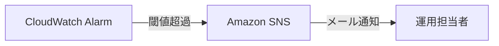

# ログ・監視設計

要件定義書 §9.3, §10.4 に基づき、ログ・監視・アラートの基本設計を定める。

## 1. ログ出力方針

| レイヤー | 出力先 | 内容 |
|---|---|---|
| Lambda | CloudWatch Logs | リクエストID、API名、処理時間、エラー内容（スタックトレースはLogsのみ、レスポンスには含めない） |
| API Gateway | CloudWatch Logs（アクセスログ） | リクエストメソッド・パス・ステータスコード・レイテンシ・呼び出しユーザー（Cognito sub） |
| CloudTrail | CloudTrail | AWSリソースに対する操作ログ（要件定義書§9.3） |

### 1.1 ログレベル

| レベル | 用途 |
|---|---|
| ERROR | 500/503相当の予期しない例外 |
| WARN | 400/403/404/409等、想定内だが注意すべき事象 |
| INFO | 正常処理の開始・終了、主要な処理ステップ |
| DEBUG | 開発環境でのみ有効化する詳細ログ（prodでは出力しない） |

### 1.2 個人情報の扱い

- メールアドレス等の個人情報はログに平文で出力しない（マスキングするか、`userId`（Cognito sub）のみ記録する）。

## 2. 監視項目・ダッシュボード（要件定義書§10.4）

| 監視項目 | 閾値 | アクション |
|---|---|---|
| APIエラー率（4xx/5xx比率） | 5%超過 | SNS経由でメールアラート |
| Lambda実行時間 | タイムアウト（30秒）超過 | アラート検知 |
| Lambda同時実行数 | アカウント上限に近づいた場合 | アラート検知（スロットリング防止） |
| DynamoDBスロットリング | 発生時 | アラート検知（オンデマンドキャパシティのため頻発は想定しないが監視は行う） |

CloudWatchダッシュボードで API エラー率・Lambda 実行時間を可視化する（要件定義書§10.4）。

## 3. アラート通知フロー

## 4. 可用性・障害対応（要件定義書§8.2）

| 項目 | 目標値 |
|---|---|
| サービス稼働率 | 99.5%以上（月間） |
| RTO（目標復旧時間） | 2時間以内 |
| RPO（目標復旧時点） | 24時間以内 |
| 計画メンテナンス | 月1回・深夜帯（事前通知あり） |

- RPO 24時間以内を満たすため、DynamoDBのポイントインタイムリカバリ（PITR）またはオンデマンドバックアップを日次で取得する運用とする（具体的なバックアップ方式はインフラ設計（`13_infra`）で確定）。

## 5. Phase外の考慮事項

- AWS WAFによるアクセス監視・防御はPhase2で導入（要件定義書§9.4）。Phase1のCloudWatch監視はアプリケーションレベルの異常検知が中心。
