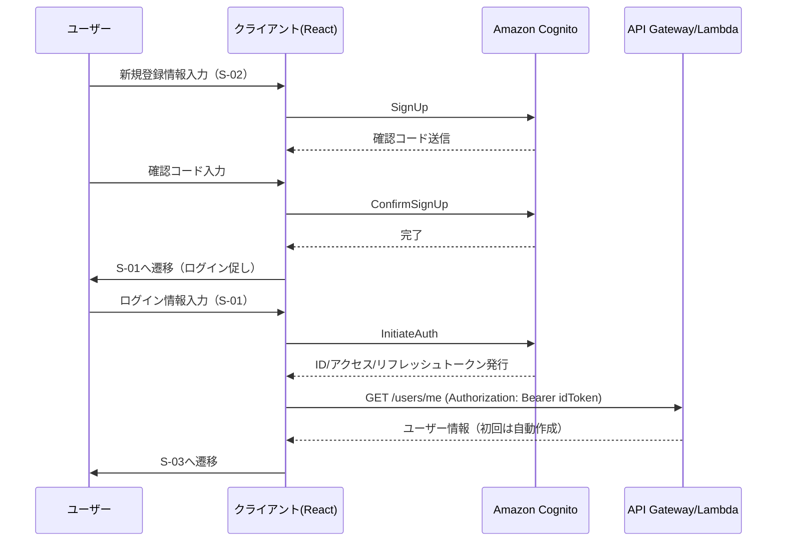

# 認証・認可設計

要件定義書 §7.1, §9.1 に基づき、認証（誰であるか）と認可（何ができるか）の設計を定める。

## 1. 認証方式

- Amazon Cognito User Pool によるメールアドレス＋パスワード認証（要件定義書 F-01）。
- 認証成功時に発行されるトークン:

| トークン種別 | 有効期限 | 用途 |
|---|---|---|
| IDトークン（JWT） | 1時間 | API Gateway への認証（`Authorization: Bearer` ヘッダ） |
| アクセストークン（JWT） | 1時間 | Cognito API呼び出し（パスワード変更等）で使用 |
| リフレッシュトークン | 30日 | IDトークン/アクセストークンの自動更新 |

- クライアント（React SPA）はトークンをブラウザ内（メモリ + セキュアな永続化。localStorage使用時はXSS対策を徹底）に保持し、有効期限切れ前にリフレッシュトークンで自動更新する。

## 2. 認可方式

### 2.1 API単位の認可

- 全APIエンドポイントに API Gateway の Cognito User Pool Authorizer を設定する（要件定義書§7.1「参照系APIも含め全エンドポイントに適用」）。
- 未認証・トークン無効・期限切れの場合、Lambda に到達する前に API Gateway が 401 を返す。

### 2.2 リソース単位の認可（所有者チェック）

トークン検証だけでは「他人のデータへのアクセス」を防げないため、以下のリソースについては Lambda 内で所有者チェックを行う（要件定義書§9.1「ユーザーは自分のデータのみアクセス可能」）。

| リソース | チェック内容 | 該当API |
|---|---|---|
| OR_T_EXAM_SESSION | `OR_T_EXAM_SESSION.userId` と、トークンの `sub` クレームが一致すること | [API-08](../02_API設計/個別API設計書/API-08_セッション更新.md), [API-09](../02_API設計/個別API設計書/API-09_セッション取得.md) |
| OR_M_USER | `OR_M_USER.userId` と、トークンの `sub` クレームが一致すること（自分自身の情報のみ取得可） | [API-10](../02_API設計/個別API設計書/API-10_ユーザー情報取得.md) |

不一致の場合は 403 Forbidden を返す（[API共通設計](../02_API設計/API共通設計.md) §5, §6 参照）。

マスタ系リソース（OR_M_QUALIFICATION, OR_M_CATEGORY, OR_M_QUESTION, OR_M_CHOICE）は全ログインユーザーが参照可能であり、所有者チェックは不要。

## 3. Cognitoクレームの利用

- Lambda（API Gateway Lambda Authorizer経由で連携される場合は `event.requestContext.authorizer.claims`）から `sub`（ユーザーID）・`email` を取得する。
- クライアントがリクエストボディ/パスパラメータで `userId` を指定してきても、Lambda はそれを信用せず、必ずトークンの `sub` を正とする。
- 全テーブルの共通項目 `createdBy`（登録者）/ `updatedBy`（更新者）も同様に、クライアント指定値ではなくトークンの `sub` を設定する（システム起因の書き込みは `SYSTEM`。[テーブル一覧](../03_データベース設計/テーブル一覧.md) §共通項目）。

## 4. パスワードポリシー・アカウント保護

- Cognito のパスワードポリシー: 8文字以上、英大文字・英小文字・数字を含む（[S-02 新規登録画面](../01_画面設計/個別画面設計書/S-02_新規登録画面.md) 参照）。
- ログイン試行回数超過時は Cognito のデフォルトのロックポリシーに従う。

## 5. サインアップ〜利用開始フロー

## 6. Phase外の考慮事項

- クライアント証明書ピンニングは Phase2（ネイティブアプリ化時）で検討（要件定義書§9.2）。
- AWS WAF はPhase2で適用（要件定義書§9.4）。Phase1では未適用。
